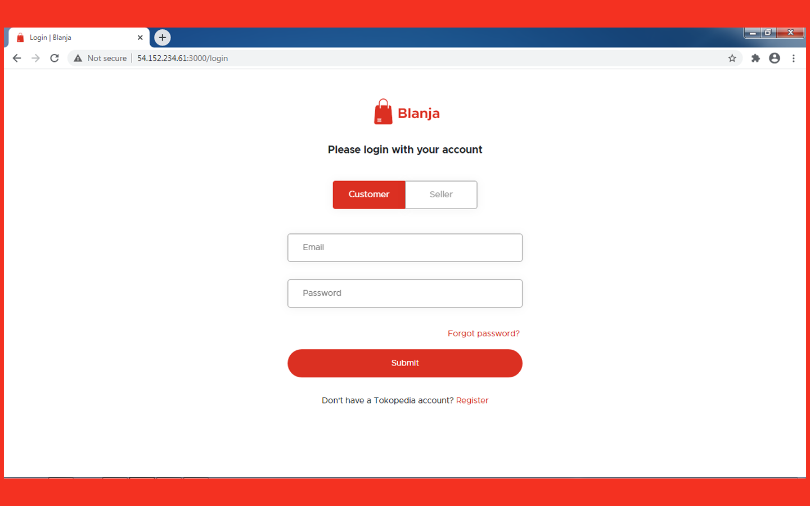
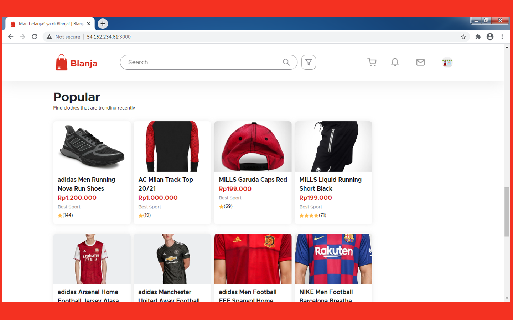
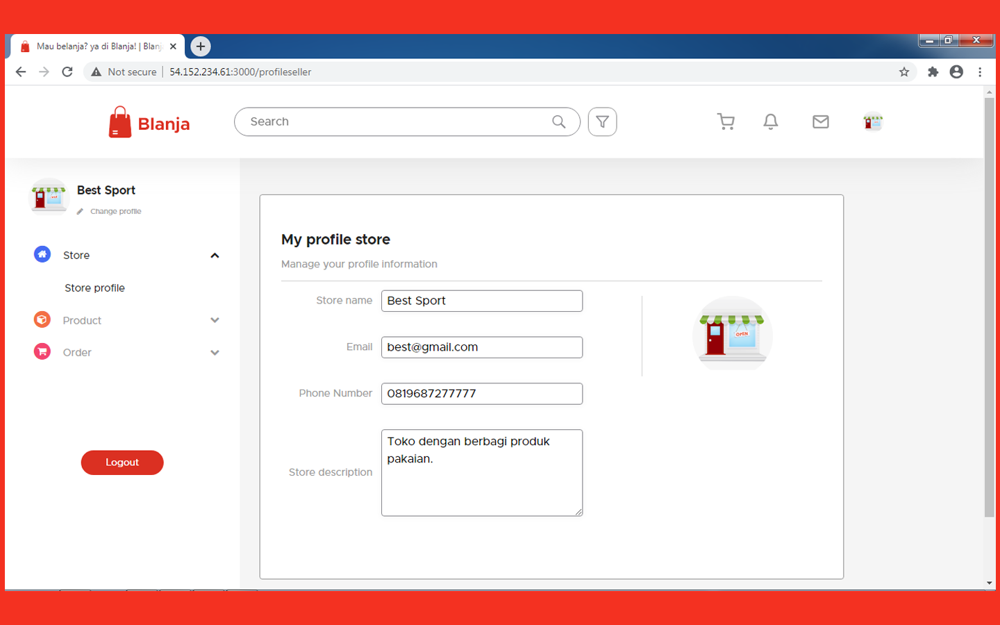

# Blanja Web 

<div align="center">
    
</div>

## Contents

- [Description](#description)
- [Features](#features)
- [Requirements](#requirements-for-development)
- [Installation](#installation-for-development)
- [Screenshoots](#screenshoots)
- [Demo Blanja Web](#demo-blanja-web)
- [Related Project](#related-project)

## Description

**Blanja Web** is a web-based e-commerce application that allows buyers to order
products of their choice. Consists of 2 types of users, namely buyers and
sellers.

## Features

- Order product
- History transaction
- Add product (admin only)
- Chat
- Edit profile
- Reset Password
- etc

## Requirements for Development

- [`Node Js`](https://nodejs.org/en/)
- [`npm`](https://www.npmjs.com/get-npm)
- [`ReactJs`](https://reactjs.org/)
- [`Blanja Backend`](hhttps://github.com/Baruak-da-Familia/blanja-api.git)

## Installation for Development

1. Open your terminal or command prompt
2. Type `git clone https://github.com/Baruak-da-Familia/blanja-frontend.git`
3. Open the folder and type `npm install` for install dependencies
4. Create file **_.env_** in root directory with the following contents :

```bash
REACT_APP_API_URL = "http://host_backend:port_backend";
REACT_APP_SOCKET_URL = "http://host_backend:port_socket";
REACT_APP_WEB_URL = "http://host_frontend:port_frontend";
```

Example : http://host_backend:port_backend is http://localhost:8000
http://host_backend:port_socket is http://localhost:8001
http://host_frontend:port_frontend is http://localhost:3000 so, you can write in
.env file like this :

```bash
REACT_APP_API_URL = "http://localhost:8000";
REACT_APP_SOCKET_URL = "http://localhost:8001";
REACT_APP_WEB_URL = "http://localhost:3000";
```

4. Before run this, you must installation backend and then run backend
5. Type `npm start` in terminal for running this project.
6. If you want to build, type `npm run build`.

## Screenshoots

<div align="center">
    
    
    
</div>

## Demo Blanja Web

This is Blanja Web build version, let's try it.

<a href="http://54.152.234.61:3000">
  
</a>

## Related Project

RESTful API for this web application, clone this for development Blanja Web.

<a href="hhttps://github.com/Baruak-da-Familia/blanja-api.git">

</a>

This project was bootstrapped with
[Create React App](https://github.com/facebook/create-react-app).

## Available Scripts

In the project directory, you can run:

### `npm start`

Runs the app in the development mode.<br /> Open
[http://localhost:3000](http://localhost:3000) to view it in the browser.

The page will reload if you make edits.<br /> You will also see any lint errors
in the console.

### `npm test`

Launches the test runner in the interactive watch mode.<br /> See the section
about
[running tests](https://facebook.github.io/create-react-app/docs/running-tests)
for more information.

### `npm run build`

Builds the app for production to the `build` folder.<br /> It correctly bundles
React in production mode and optimizes the build for the best performance.

The build is minified and the filenames include the hashes.<br /> Your app is
ready to be deployed!

See the section about
[deployment](https://facebook.github.io/create-react-app/docs/deployment) for
more information.

### `npm run eject`

**Note: this is a one-way operation. Once you `eject`, you can’t go back!**

If you aren’t satisfied with the build tool and configuration choices, you can
`eject` at any time. This command will remove the single build dependency from
your project.

Instead, it will copy all the configuration files and the transitive
dependencies (webpack, Babel, ESLint, etc) right into your project so you have
full control over them. All of the commands except `eject` will still work, but
they will point to the copied scripts so you can tweak them. At this point
you’re on your own.

You don’t have to ever use `eject`. The curated feature set is suitable for
small and middle deployments, and you shouldn’t feel obligated to use this
feature. However we understand that this tool wouldn’t be useful if you couldn’t
customize it when you are ready for it.

## Learn More

You can learn more in the
[Create React App documentation](https://facebook.github.io/create-react-app/docs/getting-started).

To learn React, check out the [React documentation](https://reactjs.org/).

### Code Splitting

This section has moved here:
https://facebook.github.io/create-react-app/docs/code-splitting

### Analyzing the Bundle Size

This section has moved here:
https://facebook.github.io/create-react-app/docs/analyzing-the-bundle-size

### Making a Progressive Web App

This section has moved here:
https://facebook.github.io/create-react-app/docs/making-a-progressive-web-app

### Advanced Configuration

This section has moved here:
https://facebook.github.io/create-react-app/docs/advanced-configuration

### Deployment

This section has moved here:
https://facebook.github.io/create-react-app/docs/deployment

### `npm run build` fails to minify

This section has moved here:
https://facebook.github.io/create-react-app/docs/troubleshooting#npm-run-build-fails-to-minify
